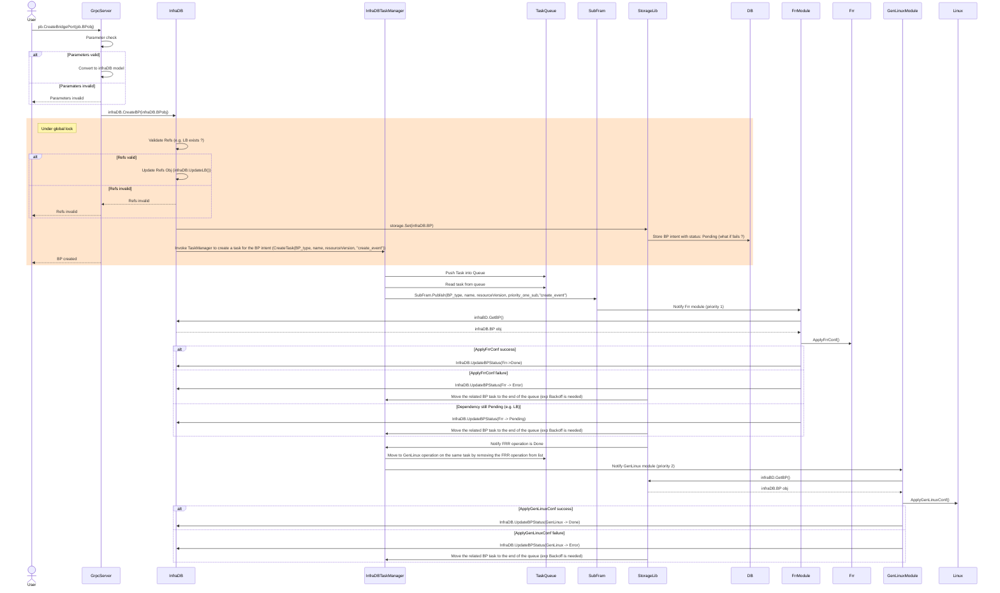

# Create Bridge Port example

### Flow

The user using the cli tool will iniate a CreateBP call towards the grpcServer. The grpcServer will initially execute all the parameter checks on the protobuf object that has arrived and if everything is valid will convert the object to the infraDB model and will call the infraDB.CreateBP(infraDB.BP obj) function.

When the infraDB.CreateBP(infraDB.BP obj) function gets called a global lock will be acquired, the validation and the update of the references will take place and finally the BridgePort intent will be stored in the Database with an automatic resourceVersion and the lock will be released.

When the intent gets stored in Database invocation of the TaskManager component will take place. The TaskManager will generate a Task with priority processes 1,2,3,4 (Frr priority 1, GeneralLinux priority 2, Vendor Linux priority 3, Vendordriver priority 4) and will put the Task at the back of the Task queue. In continuation to that the TaskManager will read the first task from the queue, will check if the task is valid by fetching the object from the DB and checking the resourceVersion and will generate notifications towards the priority 1 listener which in our case is the FrrModule. The notifications will include the name of the BP object as well as the resourceVersion of that.

The FrrModule will fetch the BridgePort object from the Database using the infraDB.GetBP(name) funtion. Then it will check if the resourceVersion of the object is the same as the one that has been received from the notification. If it is not the same then will abandon the operation. If it is the same then will take the action to apply the configuration to the FRR application. If the configuration succeeds then then FrrModule will update the Status (we need update on the API for that) of sub1 field of the object in the DB (calling the UpdateBPStatus(name, ResourceVersion, sub1, status_dict) funtion) to `Done` if it doesn't succeed will update the status of the object on the DB to `Error` and if the object depends on another object then will update the status to `Pending`.

If the Status regarding Frr is `Done` then the taskManager will move to the next operation of the same Task which is the GenLinuxModile operation (sub2).

When all the operations of the BP task in TaskManager have been completed then the BP intent has been realized.